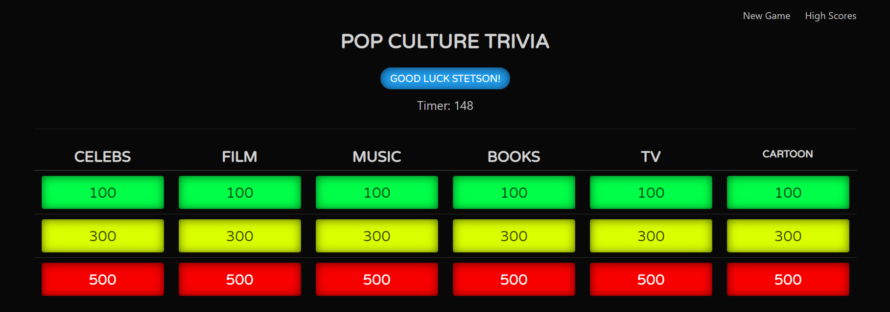

# Pop Culture Trivia

This repository "pop-culture-trivia" is a jeopardy style one player game. he Player gets to choose a question from their desired category and difficulty level. The difficulty levels are easy (100 points), medium (300 points) and hard (500 points).

User Story:
AS A gamer I WANT TO play a trivia game SO THAT I can be entertained and test my knowledge

# Access and Preview of Repository

Link = https://pmitch242.github.io/pop-culture-trivia/

Gameplay Page

# Game Play
If the Player gets the answer correct, they will hear the *correct answer* sound and will be awarded the value of the question (100 points, 300 points, or 500 points).

If the Player chooses the wrong answer, the *wrong answer* sound will play and the value of the question(100 points, 300 points, or 500 points) will be deducted from their overall score.

# Contributors
Phill Mitchell
Robin Jones
Colin Stevens

# Credits
Johns Hopkins full-Stack Bootcamp

Stetson Lewis

Donald Hesler

# License
MIT License

Copyright (c) 2019 pmitch242

Permission is hereby granted, free of charge, to any person obtaining a copy of this software and associated documentation files (the "Software"), to deal in the Software without restriction, including without limitation the rights to use, copy, modify, merge, publish, distribute, sublicense, and/or sell copies of the Software, and to permit persons to whom the Software is furnished to do so, subject to the following conditions:

The above copyright notice and this permission notice shall be included in all copies or substantial portions of the Software.

THE SOFTWARE IS PROVIDED "AS IS", WITHOUT WARRANTY OF ANY KIND, EXPRESS OR IMPLIED, INCLUDING BUT NOT LIMITED TO THE WARRANTIES OF MERCHANTABILITY, FITNESS FOR A PARTICULAR PURPOSE AND NONINFRINGEMENT. IN NO EVENT SHALL THE AUTHORS OR COPYRIGHT HOLDERS BE LIABLE FOR ANY CLAIM, DAMAGES OR OTHER LIABILITY, WHETHER IN AN ACTION OF CONTRACT, TORT OR OTHERWISE, ARISING FROM, OUT OF OR IN CONNECTION WITH THE SOFTWARE OR THE USE OR OTHER DEALINGS IN THE SOFTWARE.
